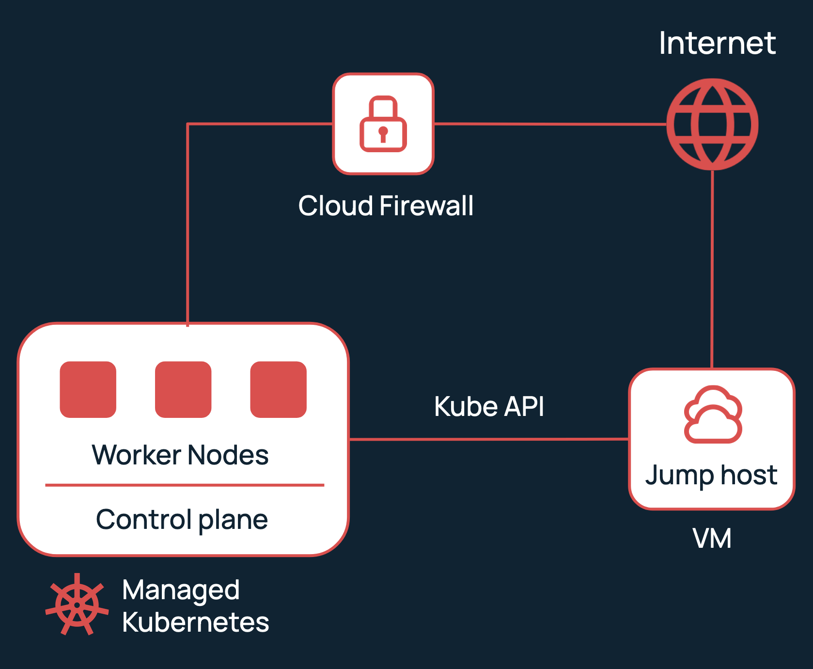

# 21.05.24 Selectel MKS Private Kube API
Create MKS cluster with private KubeAPI, jump-host and cloud firewall using Terraform.
---
Add variable to secrets.tfvars:
```
domain = "<client_id>"
domain_password = "<account administrator password>"
project_password = "<password for new service user>"
```
---
Command:
```
terraform init
terraform apply -var-file=./secrets.tfvars
```
---
Scheme:

